# ClinicalEventKnowledgeGraphs (CEKG) 
This repository contains scripts and datasets for building a clinical event knowledge graph locally. The work is related to the paper "Clinical Event Knowledge Graphs: Enriching Healthcare Event Data with Entities and Clinical Concepts," which was accepted at the 6th International Workshop on Process-Oriented Data Science for Healthcare (PODS4H23), held in conjunction with the 5th International Conference on Process Mining (ICPM 2023).


**Citation**
If you use or modify the scripts in this repository for your project, please cite the [Paper](https://doi.org/10.1007/978-3-031-56107-8_23).

**License**
This project is copyrighted by the authors (2023-now).


## Step 1: Start a Graph Database in Neo4j Desktop

To get started, you'll need to set up a Neo4j graph database. Follow these steps to install Neo4j Desktop and configure your local database.

- Go to the [Neo4j Download page](https://neo4j.com/download/) and download Neo4j Desktop. You may need to fill out a form to access the download link.
- After downloading, copy the **Neo4j Desktop Activation Key** when prompted.
- In this example, we used **Neo4j Desktop v1.6.0 for Linux**, but any version of Neo4j Desktop should work.

Once you have installed and opened Neo4j Desktop:

- Click on **"Add"** to create a new database.
- Select **"Local DBMS"** and provide the following details:
   - **Name**: Choose any name for your database.
   - **Password**: Set the password to `12345678`. *(Note: The scripts in this project are configured to use this password.)*
   - **Version**: Select **v5.23.0**. *(We recommend using this version, as other versions may require modifications to the scripts.)*

After entering the details, click **"Create"** and wait for the database to be set up. After the DBMS is created:

- Navigate to the **Plugins** section.
- Find **APOC** (a collection of useful Neo4j procedures and functions).
- Click on **Install** to add the plugin to your database.

Once the APOC plugin is installed:

- Select your newly created database.
- Click **"Start"** to run the database.


## Step 2: Create a Python Project

First, set up the Python project with a virtual environment. Once the virtual environment is activated, install the necessary packages using pip:
```bash
pip install pandas
pip install neo4j
pip install tqdm
pip install graphviz
```

## Step 3: Clone or Download the Repository and Organize the Files in the Python Project

First, download or clone the repository.
- If you are using Linux, download **Data** and **Script_for_Linux**.
- If you are using Windows, download **Data** and **Script_for_Windows**.

Copy all scripts from "Script_for_Linux" (if you are using Linux) or from "Script_for_Windows" (if you are using Windows) and paste them into the root of the project.

Additionally, copy the "Data" directory (not the files inside the "Data" directory) and paste it in the root of the project.

The tree-like structure of your file organization is shown in the following figure:

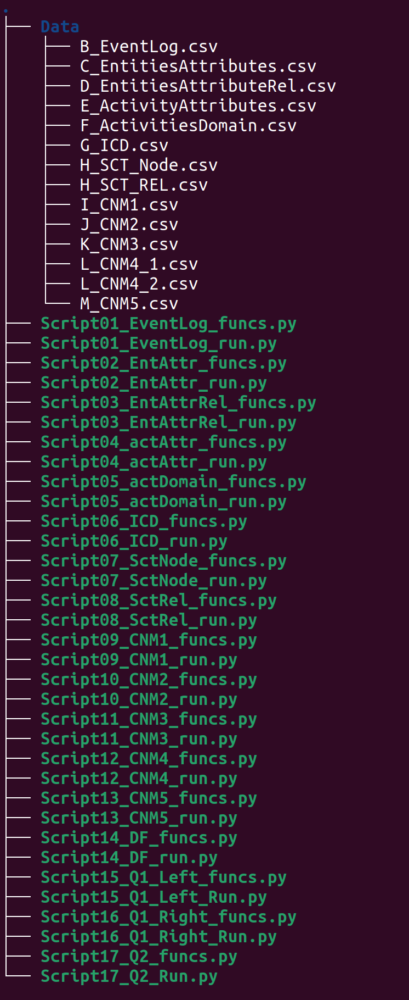


# Step 4: Abdout the Data

Before you start building the clinical event knowledge graph, we will explain the CSV files that exist in the "Data" directory. Understanding these files is important because it allows you to use your own data instead of the provided data if needed. Here, we will discuss the purpose of each CSV file.

## B_EventLog.csv

This csv file consists of our event log, which can be either a single-entity or multi-entity event log. Entities represent distinct existences. Sometimes, the terms “case notion,” “case,” “object,” and “dimensional” are used interchangeably. The term "multi-entity event log" is sometimes considered equivalent to “object-centric event log” or “multi-dimensional event log.” In the multi-entity event log definition, each entity is defined with its origin and IDs. The csv file contains several columns:

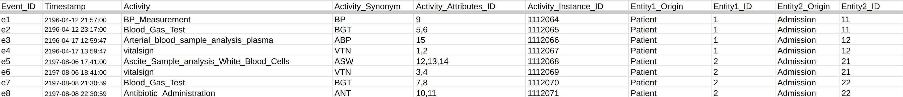


- **Event_ID:** Contains the ID of each event.
- **Timestamp:** Contains the time and date of activities.
- **Activity:** Consists of the activity label of the event.
- **Activity_Synonym:** Contains abbreviations of activity labels. For example, BGT for Blood Gas Test.
- **Activity_Attributes_ID:** A unique foreign key ID for each distinct feature and value. For example:
  - `po2=295 → Activity_Properties_ID=1`
  - `lactate=3.23 → Activity_Properties_ID=2`
  - `Blood pressure=137/79 → Activity_Properties_ID=3`
  - `po2=412 → Activity_Properties_ID=4` (same feature but different value, so a different ID)
  - `lactate=0.73 → Activity_Properties_ID=5` (same feature but different value, so a different ID)
  - `po2=295 → Activity_Properties_ID=1` (same feature and same value, so the same ID)
  - `lactate=3.23 → Activity_Properties_ID=2` (same feature and same value, so the same ID)
- **Activity_Instance_ID:** A unique foreign key identifier for each distinct activity, considering its features and values. For example:
  - First event: `Blood Gas Test: po2=295, lactate=3.23 → Activity_Value_ID=1`
  - Second event: `BP_measurement: Blood pressure=137/79 → Activity_Value_ID=2` (different activity from the first event)
  - Third event: `Blood Gas Test: po2=412, lactate=0.73 → Activity_Value_ID=3` (same activity as the first event but with different feature values)
  - Fourth event: `Blood Gas Test: po2=295, lactate=3.23 → Activity_Value_ID=1` (same activity as the first event with the same feature values)
- **Entity1_origin** and **Entity1_ID:** Contain the origin and ID of each instance of the first entity. For example, the first entity instances could be “Patient1,” “Patient2,” etc.
- **Entity2_origin** and **Entity2_ID:** Contain the origin and ID of each instance of the second entity. For example, the second entity instances could be “Admission11,” “Admission12,” etc.


## C_EntitiesAttributes.csv

This csv file contains the attributes of our entities. Each entity can have several attributes, which can either be used as entities themselves or only as attributes.

For example, age, gender, and admission are attributes of the Patient entity, as each patient has an age, gender, and admission sequence. Additionally, multimorbidity, treated multimorbidity, untreated multimorbidity, and new multimorbidity are attributes of the Admission entity. Similarly, each disorder is an attribute of multimorbidity, treated multimorbidity, untreated multimorbidity, and new multimorbidity.

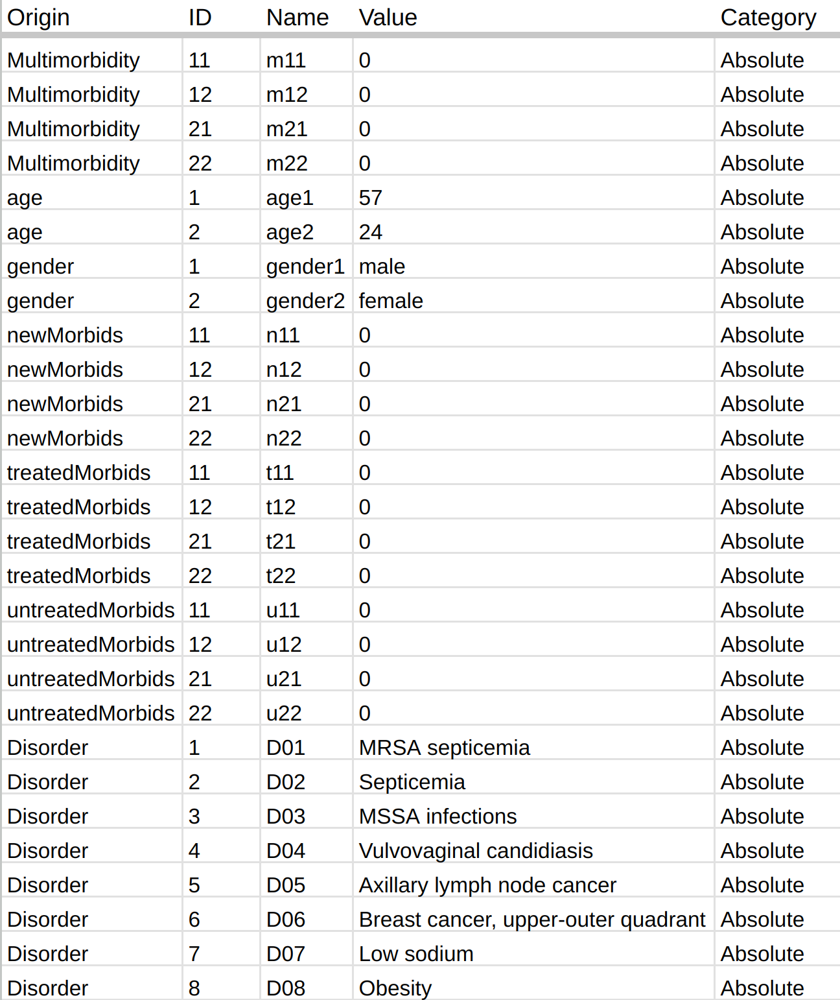


- **Origin:** This column shows the type of attribute.
- **ID:** This column shows the ID of the attribute.
- **Name:** This column contains a mix of synonyms for origins and IDs.
- **Value:** This column contains the value of the attribute, if it exists.
- **Category:** This column has the value "absolute" for all attributes that are only used for data analysis.

## D_EntitiesAttributeRel.csv

This csv file shows the relationship between entities and their attributes.

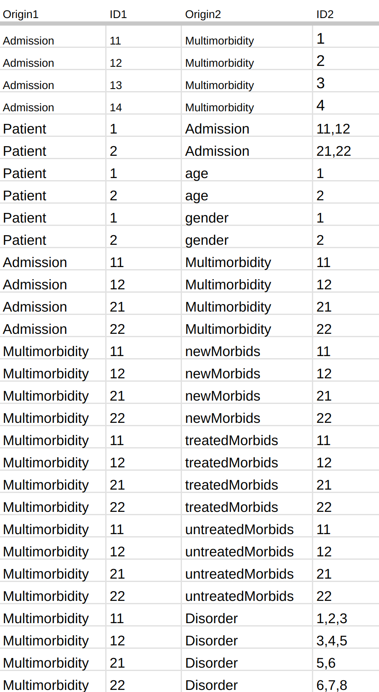


- **Origin1:** This column contains the origin of the first entity or entity attribute.
- **ID1:** This column contains the ID of the first entity or entity attribute.
- **Origin2:** This column contains the origin of the second entity or entity attribute.
- **ID2:** This column contains the ID of the second entity or entity attribute.

## E_ActivityAttributes.csv

This csv file of the dataset shows the activity attributes.

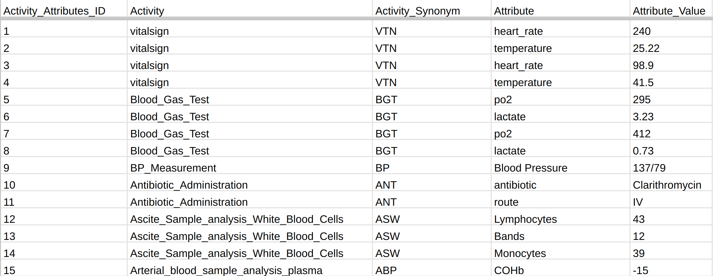


- **Activity_Attributes_ID:** This column contains a foreign key that relates to the event log csv file.
- **Activity:** This column shows the activity, corresponding to the "Activity" column in the event log csv file.
- **Activity_Synonym:** This column shows the synonym for the activity, with a corresponding column of the same name in the event log csv file.
- **Attribute:** This column contains the attributes.
- **Attribute_Value:** This column contains the values of the attributes.

## F_ActivitiesDomain.csv

This csv file contains the domain of activities, which consists of only one column.

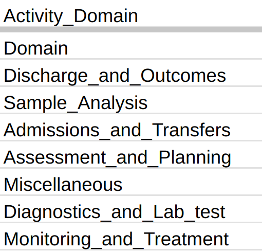

## G_ICD.csv

This csv file of our dataset contains an excerpt of our ICD codes.

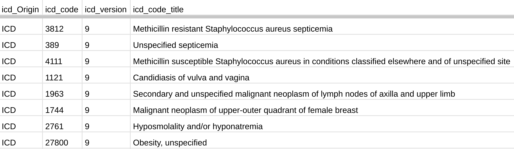

- **ICD_Origin:** This column contains values for all ICD entries. It is an auxiliary column used solely for data analysis.
- **ICD_Code:** This column shows the ICD codes.
- **ICD_Version:** This column shows the version of the ICD codes.
- **ICD_Code_Title:** This column shows the titles of the ICD codes.

## H_SCT_Node.csv

This csv file of our dataset contains an excerpt of our SNOMED CT concept codes.

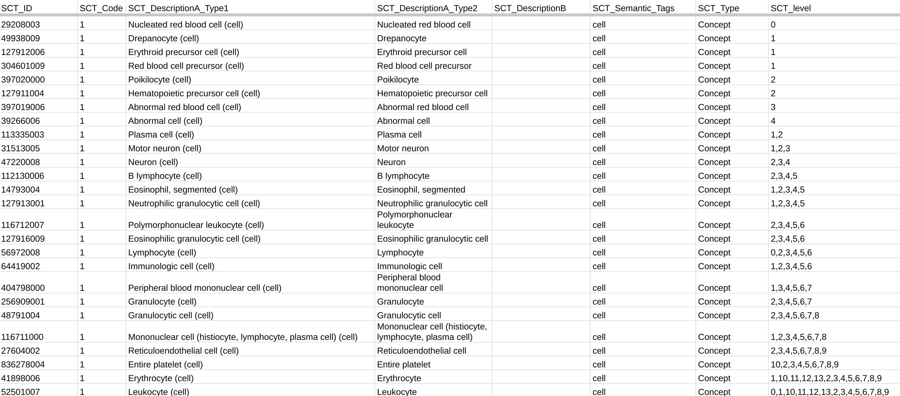

- **SCT_ID:** This column contains the SNOMED CT ID.
- **SCT_Code:** This column is an auxiliary column used in this csv file, not related to SNOMED CT terminology.
- **SCT_DescriptionA_Type1:** This column shows the description of SNOMED CT IDs with their semantic tag in parentheses.
- **SCT_DescriptionA_Type2:** This column shows the description of SNOMED CT IDs without their semantic tag in parentheses.
- **SCT_DescriptionB:** This column shows another description of SNOMED CT IDs, which exists only for some of them.
- **SCT_Semantic_Tags:** This column contains the semantic tags of SNOMED CT IDs.
- **SCT_Type:** This column contains the type of SNOMED CT, used to categorize SNOMED CT into three categories: root (only one ID, 138875005), top-level concept (we have 18 SNOMED CTs), and concept (all other IDs besides root and top-level concepts).
- **SCT_Level:** This is an index we used that shows the distance of a SNOMED CT ID from the root SNOMED CT ID (138875005). Sometimes, there are different paths to navigate from a SNOMED CT ID to the root SNOMED CT ID, so it may have more than one level. This index facilitates and enhances the speed of queries.

## H_SCT_REL.csv

This csv file shows the relationships between SNOMED CT concepts.

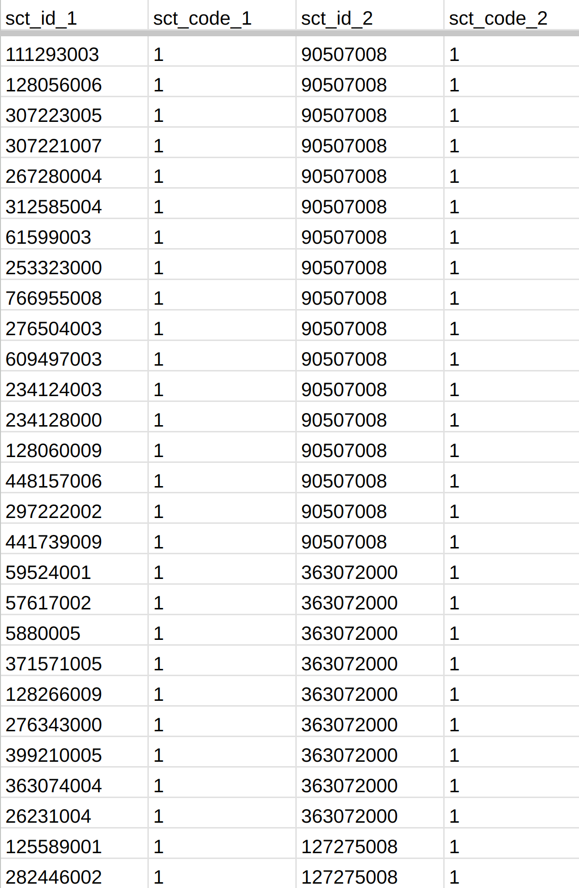

- **SCT_ID_1:** The ID of the first SNOMED CT concept node.
- **SCT_Code_1:** The code of the first SNOMED CT concept node.
- **SCT_ID_2:** The ID of the second SNOMED CT concept node.
- **SCT_Code_2:** The code of the second SNOMED CT concept node.

## I_CNM1.csv

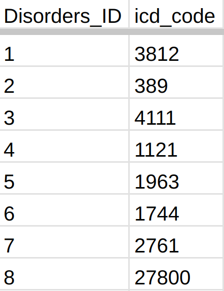

This csv file shows the constrained node mappings derived from the MIMIC-IV dataset, which relate each Disorder_ID (an attribute of multimorbidity) to each ICD code.

- **Disorder_ID:** This column shows the disorder attribute identifier.
- **ICD_Code:** This column contains the ICD code.

## J_CNM2.csv

This csv file shows the constrained node mappings derived from "OHDSI Athena" for relating ICD codes to SNOMED CT.
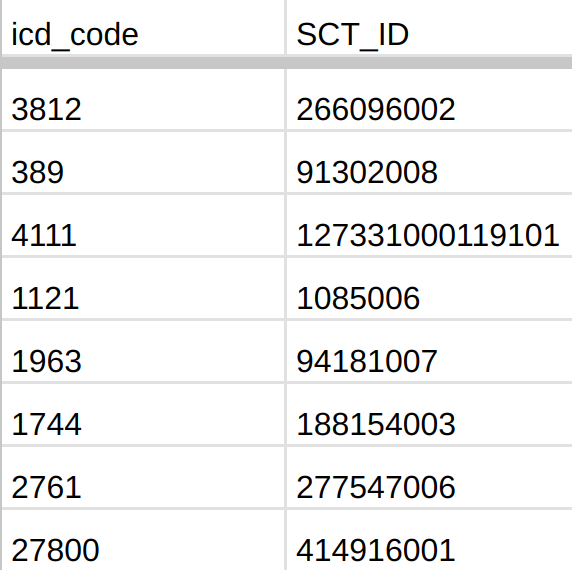


- **ICD_Code:** This column contains the ICD codes.
- **SCT_ID:** This column contains the SNOMED CT IDs.

## K_CNM3.csv

This csv file shows the constrained node mappings derived manually by searching to relate activities to SNOMED CT concepts.

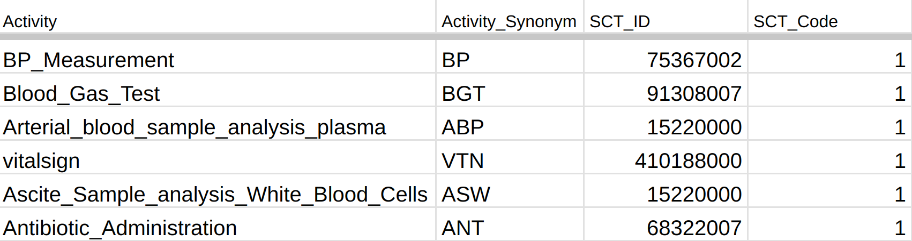


- **Activity:** This column shows the activity, corresponding to the "Activity" column in the event log csv file.
- **Activity_Synonym:** This column shows the synonym for the activity, with a corresponding column of the same name in the event log csv file.
- **SCT_ID:** This column contains the SNOMED CT IDs.
- **SCT_Code:** This column contains the SNOMED CT codes.

## L_CNM4_1.csv

This csv file shows the constrained node mappings derived manually by searching to relate activities to domains.

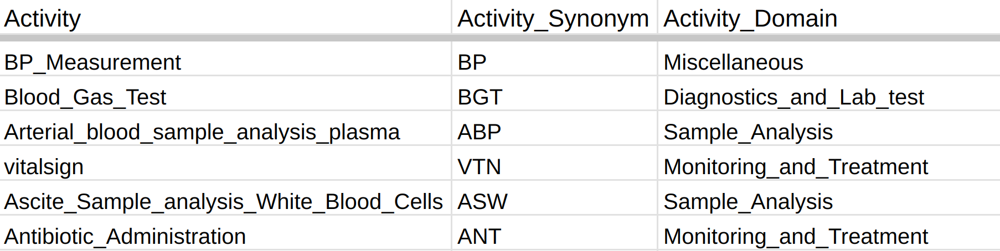


- **Activity:** This column shows the activity, corresponding to the "Activity" column in the event log csv file.
- **Activity_Synonym:** This column shows the synonym for the activity, with a corresponding column of the same name in the event log csv file.
- **Activity_Domain:** This column shows the domain of activities.

## L_CNM4_2.csv

This csv file shows the constrained node mappings derived manually by searching to relate the domain of activities to SNOMED CT concepts.

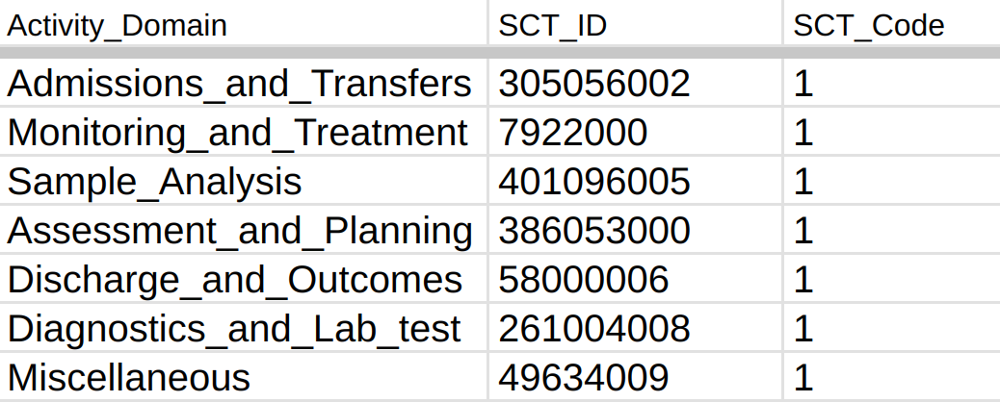


- **Activity_Domain:** This column shows the domain of activities.
- **SCT_ID:** This column contains the SNOMED CT IDs.
- **SCT_Code:** This column contains the SNOMED CT codes.

## M_CNM5.csv

This csv file shows the constrained node mappings derived from training a supervised machine learning model to relate activity instance identifiers to disorder identifiers. By using this csv file, we can include another entity (disorder) in addition to the Patient and Admission entities in our analysis.

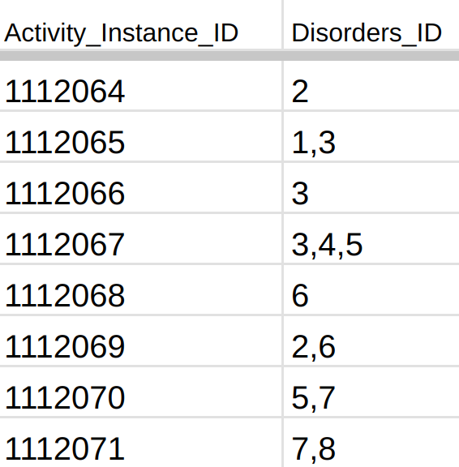


- **Activity_Instance_ID:** This column contains the activity instance identifiers. This foreign key can be related to the event log csv file.
- **Disorders_ID:** This column contains the identifiers of disorder attributes.


# Step 6: Building the Clinical Event Knowledge Graph

For building the clinical event knowledge graph, different steps—one for each csv file defined.

## Creating a Labeled Property Graph for the Event Log

By runing the **Script01_EventLog_run.py**, the Event Log sheet is converted into an Event Log graph.

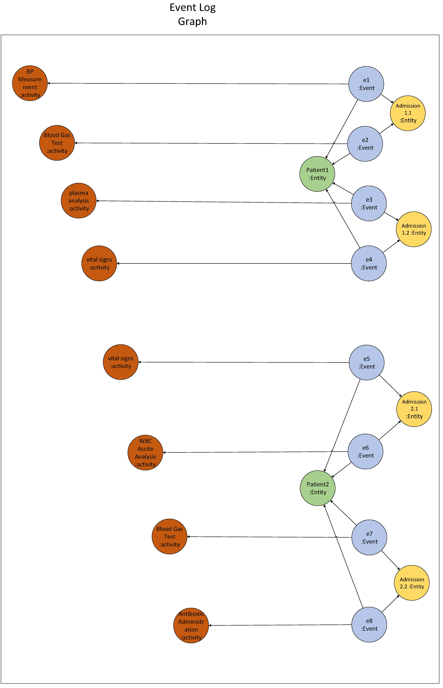

The queries executed step by step are as follows:

- Clearing the Database
- Clearing the Constraints
- Creating the Constraints for the Event Log's LPG
- Clearing a Node for the Event Log
- Creating Nodes for Each Event
- Creating Nodes for Each Entity Instance
- Creating Nodes for Each Activity Instance
- Creating Nodes for Each Activity Attribute ID Instance
- Linking the Event Log Node to the Event Nodes with a 'HAS' Relationship
- Linking the Event Nodes to the Entity Nodes with a 'CORR' Relationship
- Linking the Event Nodes to the Activity Nodes with an 'OBSERVED' Relationship
- Linking the Event Nodes to the Activity Properties Nodes with a 'MONITORED' Relationship

## Creating a Labeled Property Graph for Entities Attributes

By runing the **Script02_EntAttr_run.py**, a node will be created for each row in the Entities Attributes sheet of the Excel file:

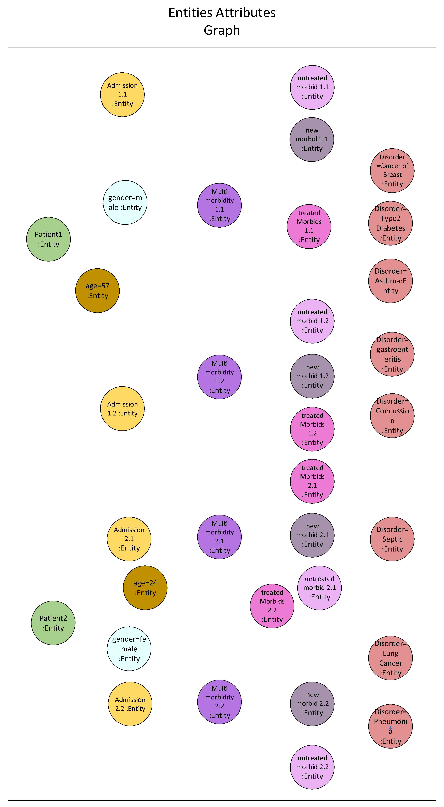

The queries executed step by step are as follows:

- Clearing the Database Except for the Previously Created Ones
- Clearing the Constraints Except for the Previously Created Ones
- Creating the Constraints for the Entities Attributes' LPG
- Creating Nodes for Each of the Entities Attributes' Instances


## Creating Relationships Between Entities and Entities Attributes

By runing the **Script03_EntAttrRel_run.py**, the Entities Attributes graph is created by establishing relationships between the entities attributes nodes, using the data from the Entities Attributes sheet in the Excel file.

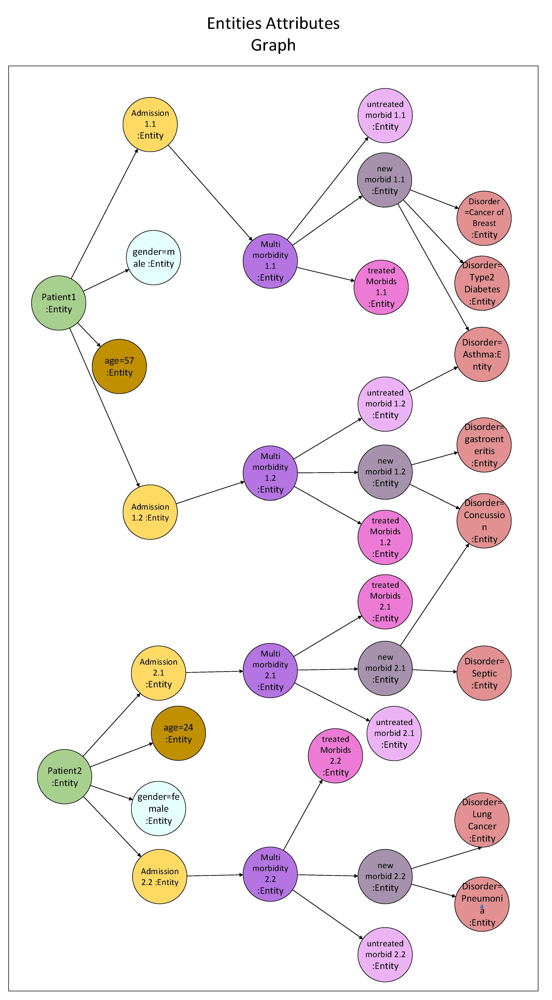

The queries executed step by step are as follows:

- Clearing the database except for the previously created ones
- Clearing the constraints except for the previously created ones
- Creating the relationship between different entities attributes named 'INCLUDED'
- Clearing the database except for the previously created ones
- Clearing the constraints except for the previously created ones
- Linking the admission treated disorders nodes to the disorders nodes with a relationship named 'INCLUDED'
- Linking the admission untreated disorders nodes to the disorders nodes with a relationship named 'INCLUDED'
- Linking the admission new disorders nodes to the disorders nodes with a relationship named 'INCLUDED'
- Adding a property to the 'Multimorbidity' node to store the disorders named 'Value'
- Adding a property to the 'Admission Treated Disorders' node to store the disorders named 'Value'
- Adding a property to the 'Admission Untreated Disorders' node to store the disorders named 'Value'
- Adding a property to the 'Admission New Disorders' node to store the disorders named 'Value'


## Creating a Labeled Property Graph for Activity Attributes

By runing the **Script04_actAttr_run.py**, activity attributes are added to the Event Log graph. These activity attributes are sourced from the Activities Attributes sheet in the Excel file.

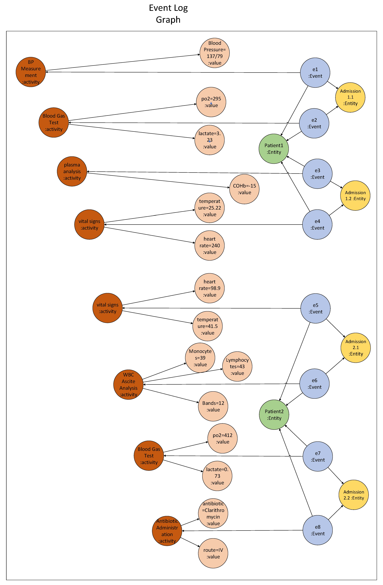

The queries executed step by step are as follows:

- Clearing the database except for the previously created ones
- Clearing the constraints except for the previously created ones
- Creating the constraints for the Activities Attributes’ LPG
- Creating nodes for each feature instance (Activity Attributes Labels and Values)
- Linking the Activity Attributes nodes to the feature nodes with a relationship named 'ASSIGN'


## Creating a Labeled Property Graph for Activities Domains

By runing the **Script05_actDomain_run.py**, a node is created for each row in the Activity Domain sheet of the Excel file.

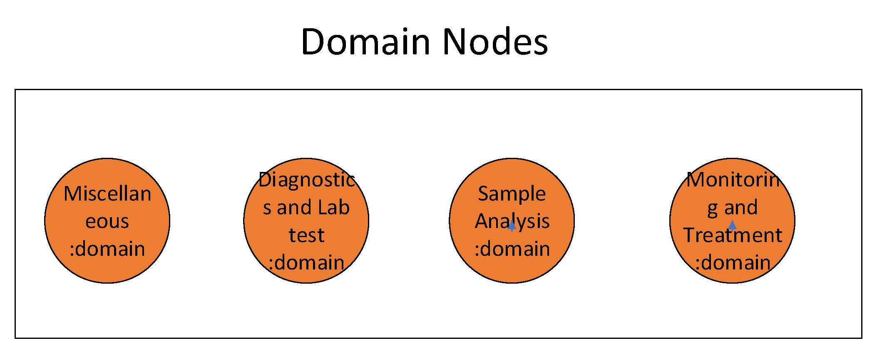

The queries executed step by step are as follows:

- Clearing the Database Except the Previously Created Ones
- Clearing the Constraints Except the Previously Created Ones
- Creating the Constraints for the Activities Domain's LPG
- Creating Nodes for Each Activities Domain Instance


## Creating a Labeled Property Graph for ICD Codes

By runing the **Script06_ICD_run.py**, a node is created for each row in the ICD sheet of the Excel file.

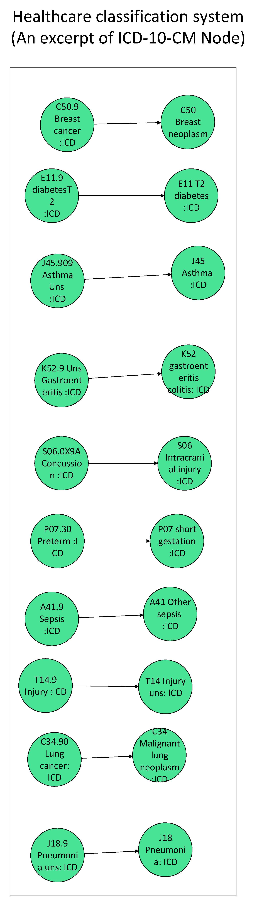

The queries executed step by step are as follows:

- Clearing the Database Except the Previously Created Ones
- Clearing the Constraints Except the Previously Created Ones
- Creating the Constraints for the ICD's LPG
- Creating Nodes for Each ICD Instance


## Creating Nodes for SNOMED-CT Concepts

By runing the **Script07_SctNode_run.py**, a node is created for each row in the SNOMED CT Node sheet of the Excel file.

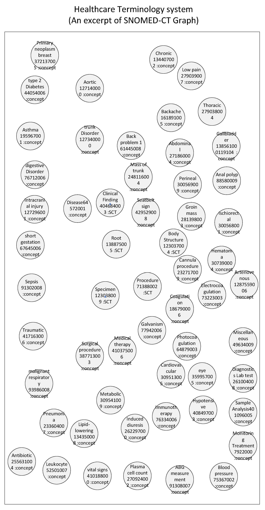

The queries executed step by step are as follows:

- Clearing the Database Except the Previously Created Ones
- Clearing the Constraints Except the Previously Created Ones
- Creating the Constraints for the SNOMED-CT's LPG
- Creating Nodes for Each SNOMED-CT Instance


## Creating Relationships Between Nodes of SNOMED-CT Concepts

By runing the **Script08_SctRel_run.py**, the SNOMED-CT graph is created by establishing relationships between the SNOMED CT nodes, using the data from the SNOMED CT Relationship sheet in the Excel file.

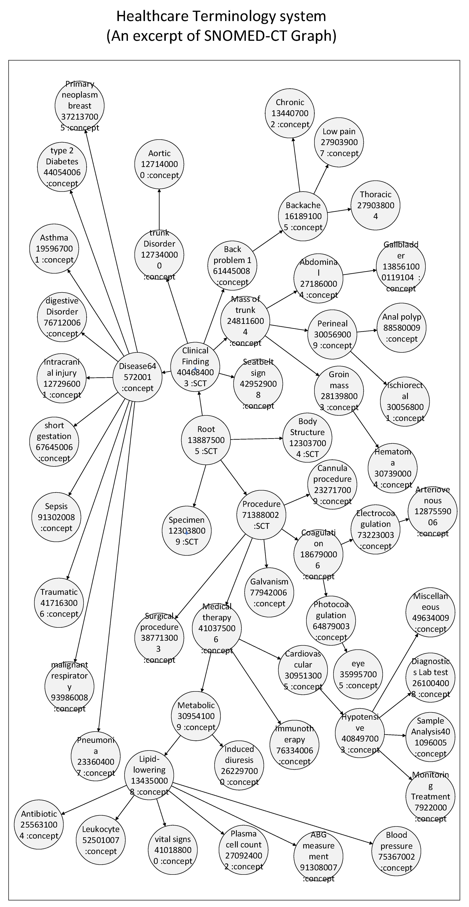

The queries executed step by step are as follows:

- Clearing the Database Except the Previously Created Ones
- Linking the SNOMED-CT Concepts Nodes Together with 'ANCESTOR_OF'
- Modifying the SNOMED-CT Concepts Nodes


## Connecting Diagnosed Disorders to ICD Codes

By runing the **Script09_CNM1_run.py**, the Disorder nodes in the Entities Attributes graph are connected to the ICD nodes using the data from the DK3 sheet in the Excel file.

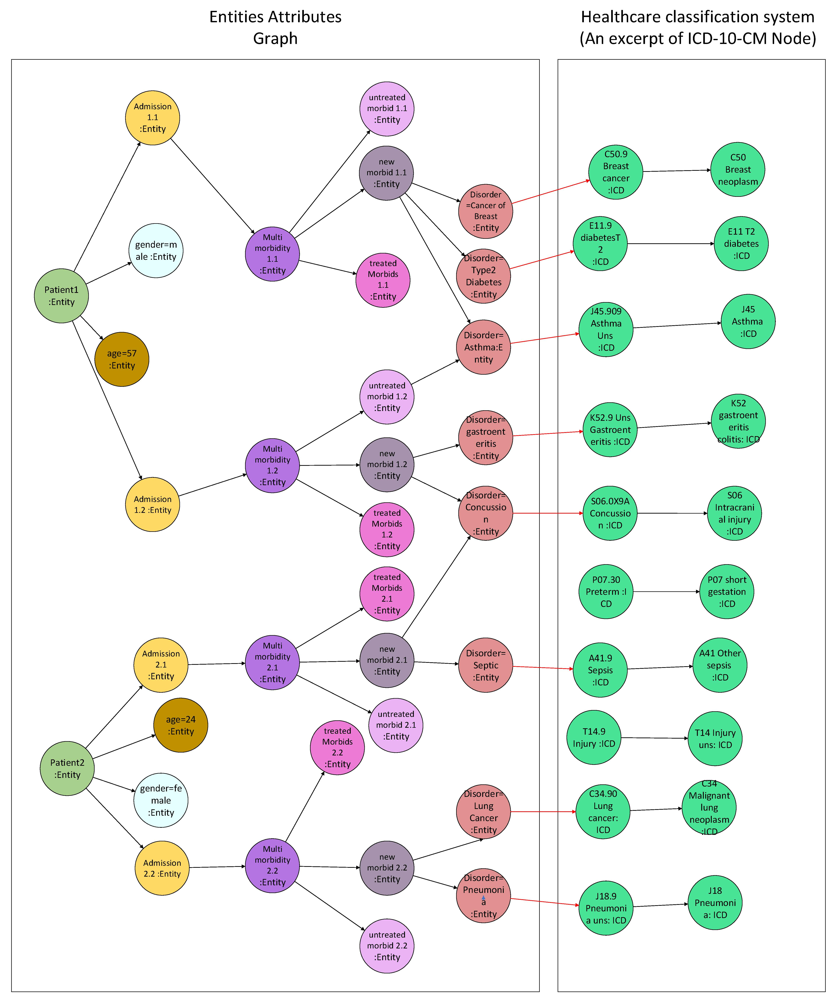

The queries executed step by step are as follows:

- Clearing the Database Except the Previously Created Ones
- Linking the Disorder Nodes to the ICD Nodes with a Relationship Named 'LINKED_TO'


## Connecting ICD Codes to SNOMED-CT ID

By runing the **Script10_CNM2_run.py**, the ICD Code graph is connected to the SNOMED-CT nodes using the data from the DK4 sheet in the Excel file.

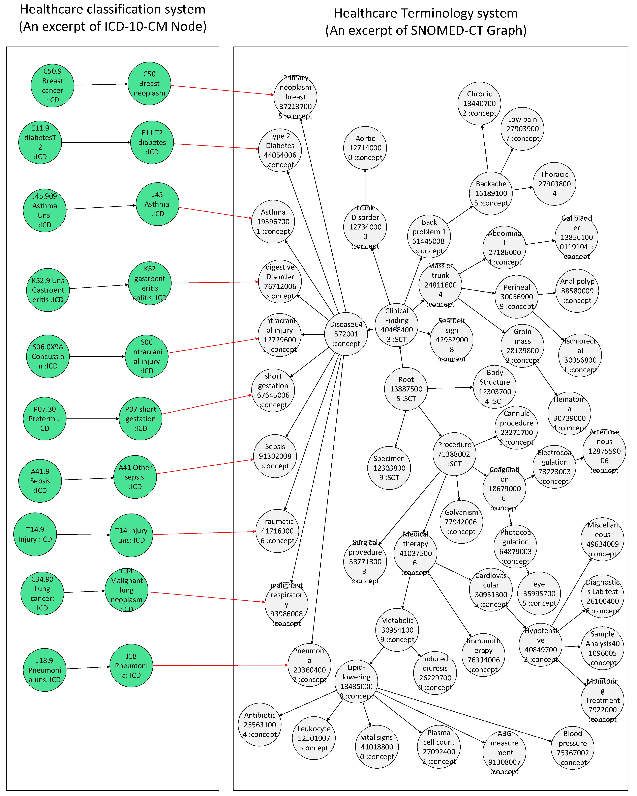

The queries executed step by step are as follows:

- Clearing the Database Except the Previously Created Ones
- Linking the ICD Nodes to the SNOMED-CT Nodes with a Relationship Named 'CONNECTED_TO'


## Connecting Activities to SNOMED-CT Codes

By runing the **Script11_CNM3_run.py**, the Activities nodes in the Event Log graph are connected to the SNOMED-CT nodes using the data from the DK5 sheet in the Excel file.

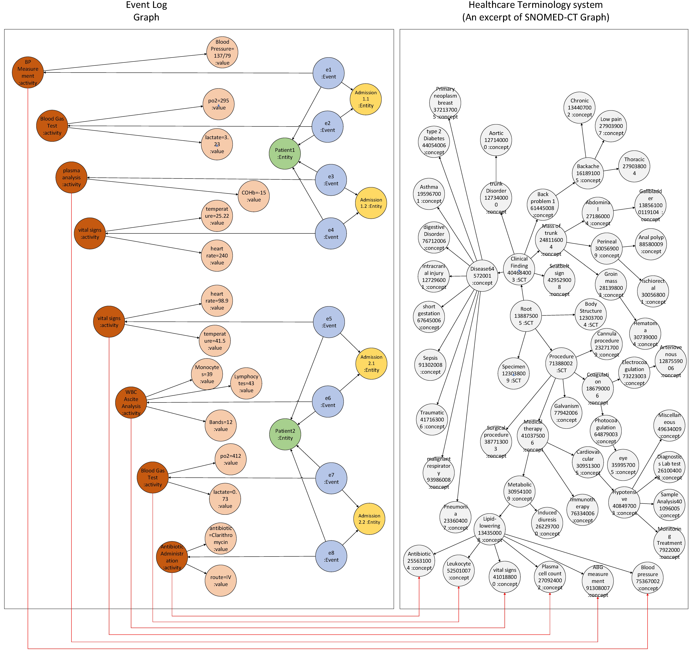

The queries executed step by step are as follows:

- Clearing the Database Except the Previously Created Ones
- Linking the Activity Nodes to the SNOMED-CT Nodes with a Relationship Named 'MAPPED_TO'
- Linking the Activity Properties Nodes to the SNOMED-CT Nodes with a Relationship Named 'MAPPED_TO'


## Connecting Activities to Domains and Connecting Domains to SNOMED-CT Codes

By runing the **Script12_CNM4_run.py**, the Activity Domains in the Event Log graph are connected to the SNOMED CT nodes using the data from the DK6_1 and DK6_2 sheets in the Excel file.


The queries executed step by step are as follows:

- Clearing the Database Except the Previously Created Ones
- Linking the Domain Nodes to the SNOMED-CT Nodes with a Relationship Named 'TIED'
- Queries for Linking the Activity Nodes to the Domain or SNOMED-CT Nodes with a Relationship Named 'TYPE_OF'
- Queries for Linking the Activity Properties Nodes to the Domain or SNOMED-CT Nodes with a Relationship Named 'TYPE_OF'


## Connecting Events to Disorders and Defining Diagnosed Disorders as New Entities

By runing the **Script13_CNM5_run.py**, the Event nodes in the Event Log graph are connected to the Disorder nodes in the Entities Attributes graph using the data from the DK7 sheet in the Excel file.

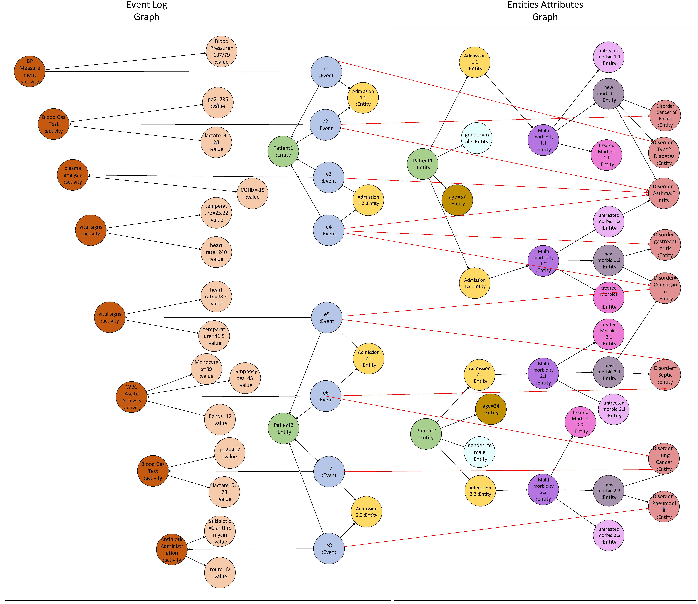

The queries executed step by step are as follows:

- Clearing the Database Except the Previously Created Ones
- Linking the Event Nodes to the SNOMED-CT Nodes with a Relationship Named 'CORR'


## Creating Directly Follows (DF) Relationships and Finalizing the Clinical Event Knowledge Graph

By runing the **Script14_DF_run.py**, the clinical event knowledge graph will be fully built by creating directly follow (DF) relationships between events, activities, and entities. The DF relationships will be established based on the options selected on the care pathway options pages.

- **If we select option 1 or 2:** The DF relationship is created between event nodes.
- **If we select option 3:** The DF relationship is created between activity nodes separately for each entity, but without considering the entity_ID (e.g., for all patients, activity a1 directly follows a2 fifty times).
- **If we select option 4:** The DF relationship is created between activity nodes separately for each entity while considering the entity_ID (e.g., for Patient 1, activity a1 directly follows a2 thirty times; for Patient 2, twenty times).
- **If we select option 5:** The DF relationship is created between activity nodes for one entity’s different IDs with respect to another entity’s non-reified IDs (e.g., for Patient 1, activity a1 directly follows a2 twenty-six times for Disorder 1).
- **If we select option 6:** The DF relationship is created between the entities (e.g., between patients, admissions, and disorders).


The queries executed step by step are as follows:

- Clearing the Database Except the Previously Created Ones
- Modifying the Event Nodes
- Creating Nodes for Reified Entities
- Linking the Entity Nodes Together with a Relationship Named 'REL'
- Linking the Entity Nodes to the Reified Entity Nodes with a Relationship Named 'REL'
- Linking the Event Nodes to the Reified Entity Nodes with a Relationship Named 'CORR'
- Creating the Directly Follows Relationship, 'DF,' Between Events
- Removing the Polluted Directly Follows Relationships for Reified Entities
- Removing the Wrong Directly Follows Relationships for Reified Entities
- Removing the Reversed Directly Follows Relationships for Reified Entities
- Removing the Polluted CORR Relationships for Reified Entities
- Restoring CORR Relationships Wrongly Deleted in the Previous Step
- Removing Reified Entities and Their REL Relationships Where No DF Relationship Exists Based on Those Reified Entities
- Creating Directly Follows by Aggregating Different IDs of Each Entity (DF_C Absolute)
- Creating Directly Follows by Aggregating Different IDs of Each Entity Origin Based on Another Entity Origin (DF_C Relative)
- Creating Directly Follows by Aggregating Different Entity Origins (DF_C All)
- Creating Directly Follows Relationship Between Each Entity (DF_E One)
- Creating Directly Follows Relationship Between Different Origin Entities (DF_E Two)
- Creating the Directly Follows Relationship Based on Activity Properties, 'DF,' Between Events
- Creating Directly Follows Based on Activity Properties by Aggregating Different IDs of Each Entity (DF_C Absolute)
- Creating Directly Follows Based on Activity Properties by Aggregating Different IDs of Each Entity Origin Based on Another Entity Origin (DF_C Relative)
- Creating Directly Follows Based on Activity Properties by Aggregating Different Entity Origins (DF_C All)

# Step 6: Answering the Questions

Finally, by querying the Clinical Event Knowledge Graph, the care pathways are discovered.


